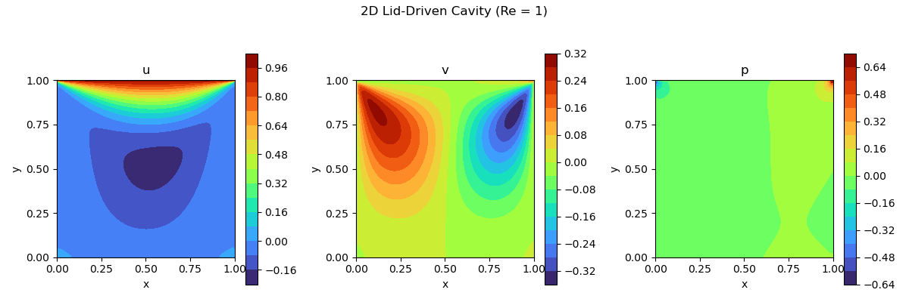

# 2D-Lid-Driven-Cavity
A C++ implementation of the 2D Lid Driven Cavity problem. Method followed from [Lorena Barba's CFDPython step 11](https://github.com/barbagroup/CFDPython/blob/master/lessons/14_Step_11.ipynb)



Tested and developed on WSL Ubuntu 24.04

## Dependencies and build
Requires Eigen Version >= 3.4.0, CMake >= 3.10, C++ 11 or later.

Eigen and CMake can be installed with the following commands:
```shell
sudo apt-get install cmake
sudo apt-get install libeigen3-dev
```

In order to build, execute the following commands from the project root:
```shell
mkdir build
cd build
cmake ..
cmake --build .
```

## Script structure
`step11.cpp` is the main file handling numerics. The equations implemented here are derived in `step11_eqnExp.md`. The file writes out data to the `data/` dir, which is plotted using the `plot_data.py` script.


Notes - 
The problem is due to checkerboarding. Maybe preserve this code status as an illustrative example. Need to read up more on how to diagnose and detect oressure checkerboarding
For Re = 100
Pressure checkerboard coefficient: -4.181641e-05 (0.000% of max pressure)
For Re = 1000
Pressure checkerboard coefficient: 1.246079e+244 (0.000% of max pressure)