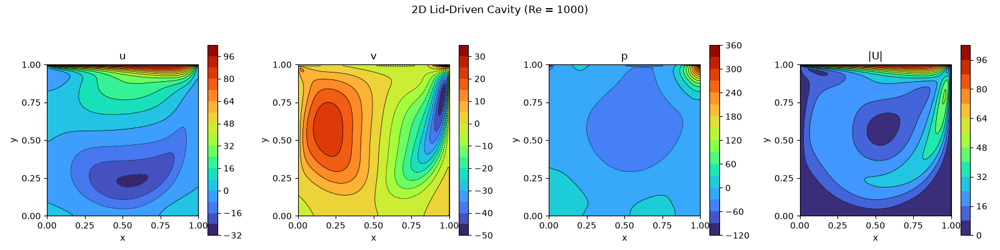
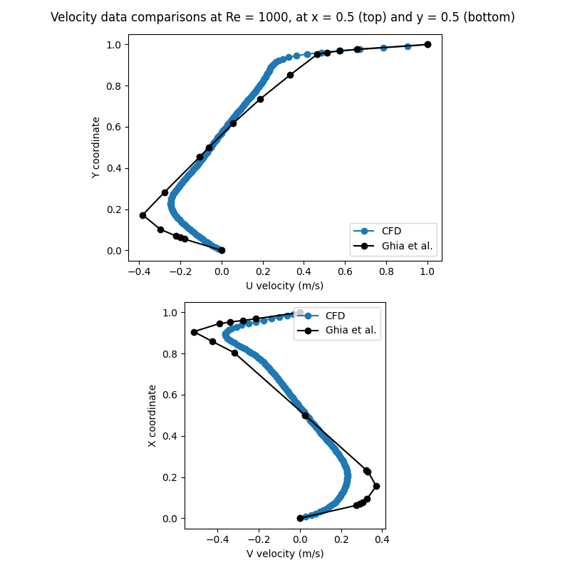

# 2D-Lid-Driven-Cavity
A C++ implementation of the 2D Lid Driven Cavity problem. Method followed from [Lorena Barba's CFDPython step 11](https://github.com/barbagroup/CFDPython/blob/master/lessons/14_Step_11.ipynb)

Tested and developed on WSL Ubuntu 24.04

## Dependencies and build
Requires Eigen Version >= 3.4.0, CMake >= 3.10, C++ 11 or later.

Eigen and CMake can be installed with the following commands:
```shell
sudo apt-get install cmake
sudo apt-get install libeigen3-dev
```

In order to build, execute the following commands from the project root:
```shell
mkdir build
cd build
cmake ..
cmake --build .
```

## Script structure
`main.cpp` is the main file handling numerics. The equations implemented here are derived in `main_eqnExp.md`. The file writes out data to the `data/` dir, which is plotted using the `plot_data.py` script.

## Results



The above images showcase the results obtained for $\mathrm{Re}$ of 1000. The data is sampled on a horizontal line at $y = 0$ and a vertical line at $x=0$ and compared with the experimental data from Ghia et al. The velocities are normalized with the lid velocity, and RMSE is calculated as:

Normalized u RMSE = 0.0759              => 7.59% error
Normalized v RMSE = 0.1086              => 10.86% error
Combined velocity RMSE = 0.1325         => 13.25% error

Looking at the values and the graph, we see that the error with the v component dominates. Higher mesh density could help with this. In addition, usage of a central differencing scheme for the velocity terms can also improve accuracy, though that would then demand a check on the Peclet number.
